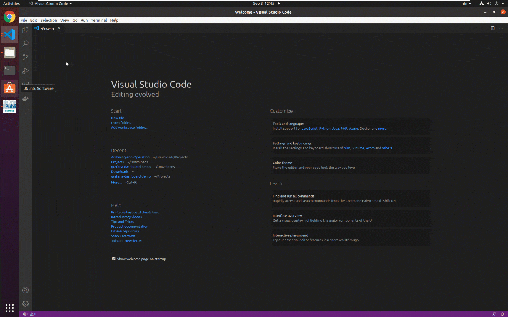
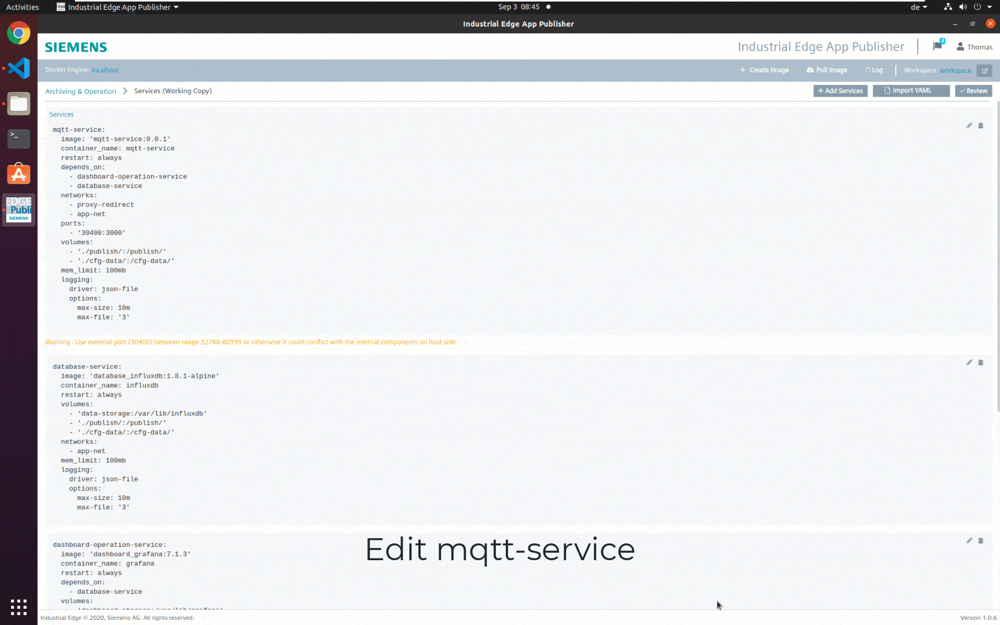
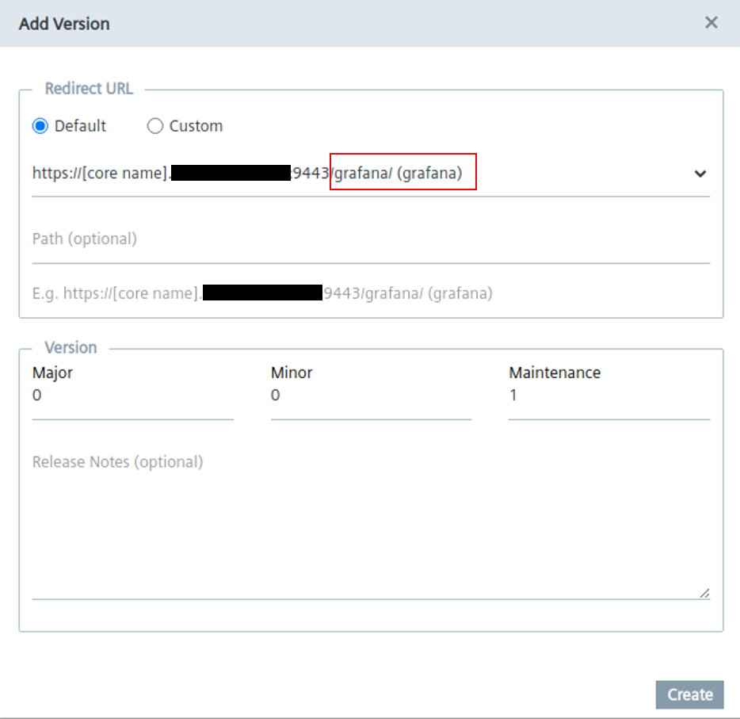
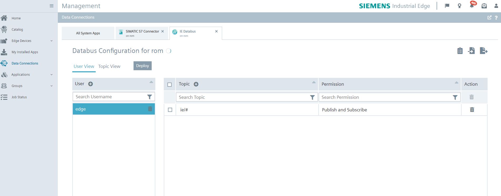
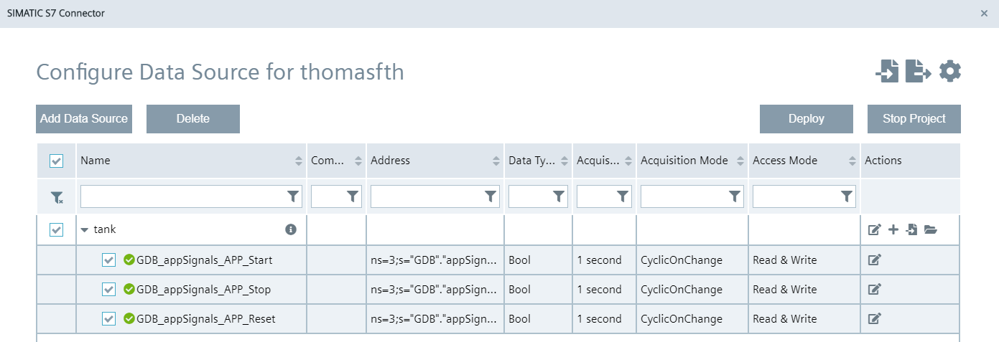
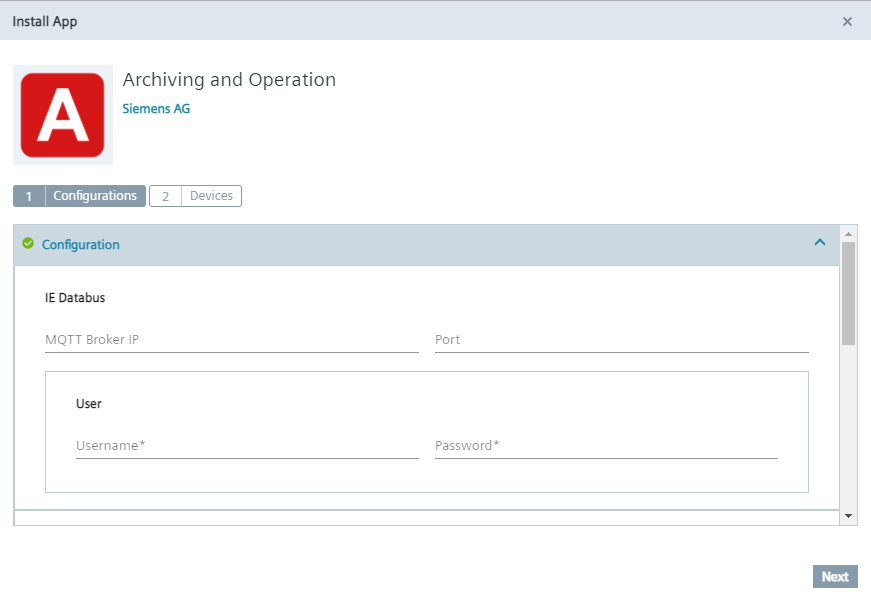
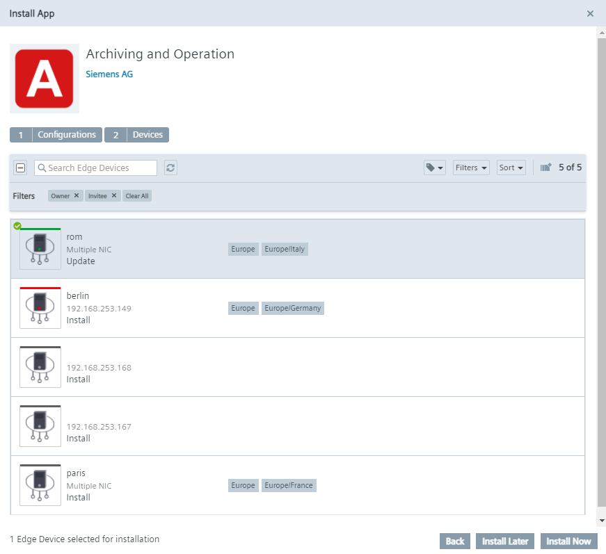
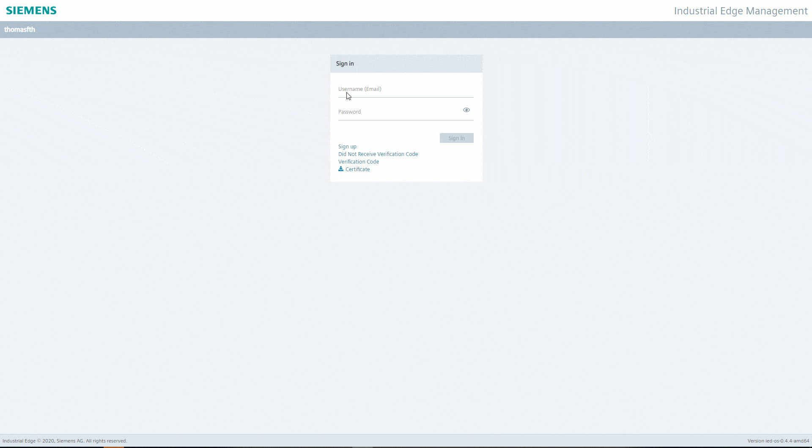

# Installation

- [Installation](#installation)
  - [Build Application](#build-application)
    - [Download Repository](#download-repository)
    - [Build docker images](#build-docker-images)
  - [Upload Application to Industrial Edge Management](#upload-application-to-industrial-edge-management)
    - [Connect your Industrial Edge App Publisher](#connect-your-industrial-edge-app-publisher)
    - [Create new Application in Industrial Edge Management](#create-new-application-in-industrial-edge-management)
    - [Configure IE Databus and SIMATIC S7 Connector](#configure-ie-databus-and-simatic-s7-connector)
    - [Add Edge App configuration & upload configuration file to Industrial Edge Management](#add-edge-app-configuration--upload-configuration-file-to-industrial-edge-management)
        - [API Security](#api-security)
        - [MQTT](#mqtt)
        - [InfluxDB](#influxdb)
        - [Server](#server)
  - [Install Application on Industrial Edge Device](#install-application-on-industrial-edge-device)
    - [Edge App configuration](#edge-app-configuration)
      - [IE Databus](#ie-databus)
        - [User](#user)
      - [S7 Connector](#s7-connector)
        - [Tag Names](#tag-names)
      - [InfluxDB](#influxdb-1)
      - [API](#api)
    - [Install Edge App](#install-edge-app)
    - [Configure Grafana](#configure-grafana)


## Build Application

### Download Repository
Download or clone the repository source code to your workstation.

### Build docker images

Open terminal in the project root path where docker-compose.yml is located and execute: 
```bash
docker-compose build
```
This command builds the docker images of the services which are specified in the docker-compose.yml file.

 

## Upload Application to Industrial Edge Management

Please find below a short description how to publish your application in your IEM.

For more detailed information please see the section for [uploading apps to the IEM](https://github.com/industrial-edge/).

### Connect your Industrial Edge App Publisher

- Connect your Industrial Edge App Publisher to your docker engine
- Connect your Industrial Edge App Publisher to your Industrial Edge Managment

### Create new Application in Industrial Edge Management

- Create a new Project or select a existing one
- Create new Application
- Import the [docker-compose](../docker-compose.yml) file using the **Import YAML** button
- The warnings <br> `Build (Detail) (services >> mqtt-service >> build) is not supported` <br> 
  `Build (Detail) (services >> influxdb >> build) is not supported.` <br> 
  `Build (Detail) (services >> grafana >> build) is not supported.` <br>
  can be ignored

- Delete Port Settings of Grafana Service (grafana)

- Configure reverse proxy of Grafana Service (grafana)
    ```txt
    Container Port: 3000
    Protocol: HTTP 
    Service Name: grafana/
    Rewrite Target: /grafana
    ```

- Delete Port Settings of MQTT Service (mqtt-service)

- Configure reverse proxy MQTT Service (mqtt-service)
    ```txt
    Container Port: 3000
    Protocol: HTTP 
    Service Name: mqtt-service
    Rewrite Target: /
    ```


- Click on `Review` and `Validate & Create`. When asked about the redirect URL, select the endpoint of the grafana service:




- **Start Upload** to transfer the app to Industrial Edge Managment
- Further information about using the Industrial Edge App Publisher can be found in the [IE Hub](https://iehub.eu1.edge.siemens.cloud/documents/appPublisher/en/start.html)

---

### Configure IE Databus and SIMATIC S7 Connector  
1. Configure a user with password in the IE Databus for the SIMATIC S7 Connector and the Archiving & Operation Application for publishing and subscribing to topics on the IE Databus. 
   ```txt
   User name: edge 
   Password: edge 
   Topic: ie/# 
   Permission: Publish and Subscribe
   ```


2. Add the PLC as a data source with data source type e.g. OPC-UA. Name of Datasource needs to 
3. Add variables to collect data as described in Archiving & Visualization How To [docs](https://github.com/industrial-edge/archiving-and-visualization/README.md#prerequisite).
4. Add Variables wit Access mode "read & write"
  ```txt
  Start 
    Name: GDB_appSignals_APP_Start
    Address: ns=3;s="GDB"."appSignals"."APP_Start"
  Stop 
    Name: GDB_appSignals_APP_Stop 
    Address: ns=3;s="GDB"."appSignals"."APP_Stop"
  Reset 
    Name: GDB_appSignals_APP_Reset
    Address: ns=3;s="GDB"."appSignals"."APP_Reset"
  ```


1. Enter Databus credentials <br>

<a href="graphics/simatic-s7-connector-bulk.png"></a>
<br>

### Add Edge App configuration & upload configuration file to Industrial Edge Management
The MQTT Service can be configured with a form. The form is based on JSONForms. If no configuration is provided during app installation, the application uses default values seen in the following json-file.
```json
{
    "API_SECURITY": {
        "USERNAME": "admin",
        "PASSWORD": "changeMe1!"
    },
    "MQTT": {
        "HOST": "ie-databus",
        "PORT": "1883",
        "USERNAME": "edge",
        "PASSWORD": "edge",
        "DEFAULT_TOPIC_NAME": "ie/d/j/simatic/v1/s7c1/dp/",
        "DEFAULT_METADATA_TOPIC_NAME": "ie/m/j/simatic/v1/s7c1/dp",
        "DATA_SOURCE_NAME": "Tank",
        "TAG_NAME_START": "GDB_appSignals_APP_Start",
        "TAG_NAME_STOP": "GDB_appSignals_APP_Stop",
        "TAG_NAME_RESET": "GDB_appSignals_APP_Reset"
    },
    "INFLUXDB": {
        "HOST": "influxdb",
        "PORT": "8086",
        "USERNAME": "root",
        "PASSWORD": "root",
        "MEASUREMENT": "edge",
        "DATABASE": "databus_values"
    },
    "SERVER": {
        "PORT": "3000"
    }
}
```

##### API Security
Set your own username and password. These credentials are later needed when configuring the operations-panel in Grafana.
- USERNAME: The username is needed to authenticate at the MQTT API 
- PASSWORD: The password is needed to authenticate at the MQTT API (change recommended)
##### MQTT
- HOST: This is the service name of the IE Databus
- PORT: This is the port of the IE Databus
- USER, PASSWORD: The user and password are configured in the IE Databus and used in the SIMATIC S7 Connector for accessing (publish, subscribe) to topics on the IE Databus
- DEFAULT_TOPIC_NAME: This is the default topic root path for data of the SIMATIC S7 Connector
- DEFAULT_METADATA_TOPIC_NAME: This is the default topic root path for metadata of the SIMATIC S7 Connector
- DATA_SOURCE_NAME The data source Name is configured in the SIMATIC S7 Connector Configurator. Insert here the data source Name for your PLC-Connection
- TAG_NAME_START, TAG_NAME_STOP, TAG_NAME_RESET The variable Names are the names of the PLC-Tags (Datablock GDP > Variable appSignals > APP_Start, APP_Stop APP_Reset) which are configured in the data source of the SIMATIC S7 Connector Configurator.

##### InfluxDB
- INFLUXDB_IP: Service name of InfluxDB which is specified in docker-compose. Do not change unless you are trying to connect to a different instance of influxdb. Grafana adds a datasource from type InfluxDB and connects to same InfluxDB instance using the same service name.
- INFLUXDB_DATABASE: InfluxDB can have multible database running in the same instance. Data which are collected from databus are written to that database. Grafana adds as datasource the InfluxDB and specifies this database as data input.

##### Server
- PORT: Server Port which NodeJS server is using

1. Select your application in Industrial Edge App Publisher
   


2. Add Configuration to application
   ```txt
   Display Name: Configuration
   Description: JSONForms Configuration
   Host Path: ./cfg-data/
   Add Template 
   - Name: JSONForms
   - Description: JSONForms Configuration
   - JSON Schema: set checkbox
   ```


## Install Application on Industrial Edge Device

### Edge App configuration
Fill out Input-Form and select checkbox (check box green)


#### IE Databus
- MQTT Broker IP: optional
- PORT: optional
##### User
- Usernname: required
- Password: required
#### S7 Connector
- Data Source Name: required
##### Tag Names
- Start: required
- Stop: required
- Reset: required
#### InfluxDB
- InfluxDB IP: optional
- Database Name: optional
#### API
- Username: required
- Passord: required


### Install Edge App
Install Edge Application to Industrial Edge Device and select app configuration


---

### Configure Grafana
1. Open Industrial Edge Device in Browser and open installed application
2. Login to Grafana-Dashboard UI: Username: admin, Password: admin
3. Grafana Welcome Page: Open Dashboard Manager
4. Open Operations Panel
5. Edit Button in Operations Panel
6. Replace the IP-Address (192.168.253.144) with the IP-Address of your Industrial Edge Device and insert Username and Password for the API Security from configuration file
7. Repeat this procedure for all Buttons (Start, Stop, Reset)
